# 4. System Usage Guide

This guide is written for non-developer users and operators.

## 4.1 Open BizPulse

Open the deployed BizPulse application in a browser.

Main navigation sections:

- Data Workspace
- Today Overview
- Sales & Advertising
- Inventory & Replenishment
- Profit & Cost
- AI Decision Center
- Administrator Console

The app shows `Data ready` when the current published dataset is available.

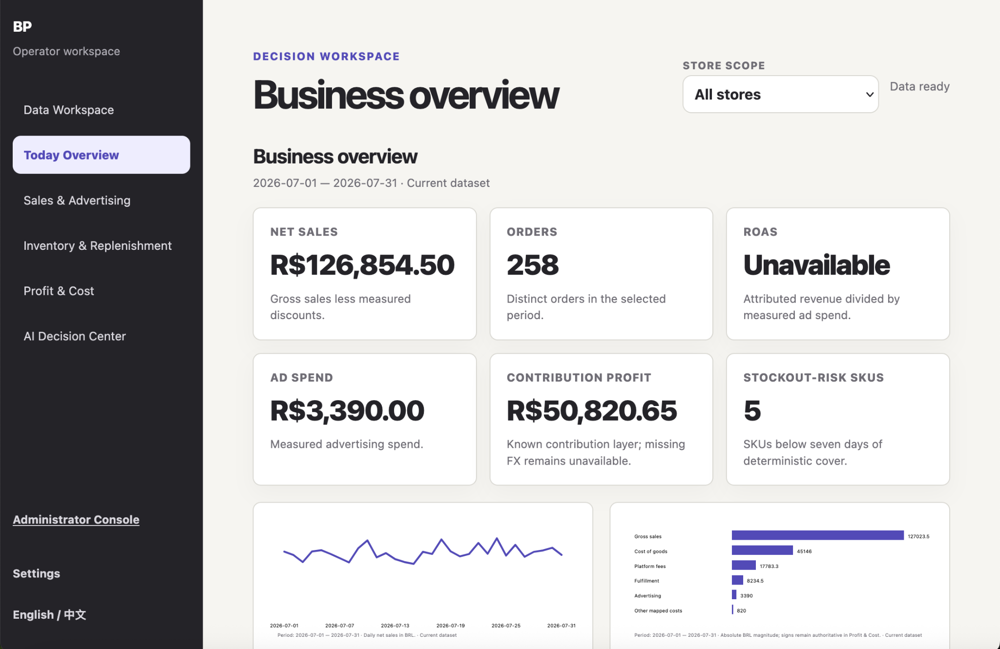

## 4.2 Upload a File

Go to **Data Workspace → Upload → 1. Files**.

1. Choose or drag a CSV/XLSX file.
2. Confirm the file appears in the list.
3. Click **Upload selected files**.

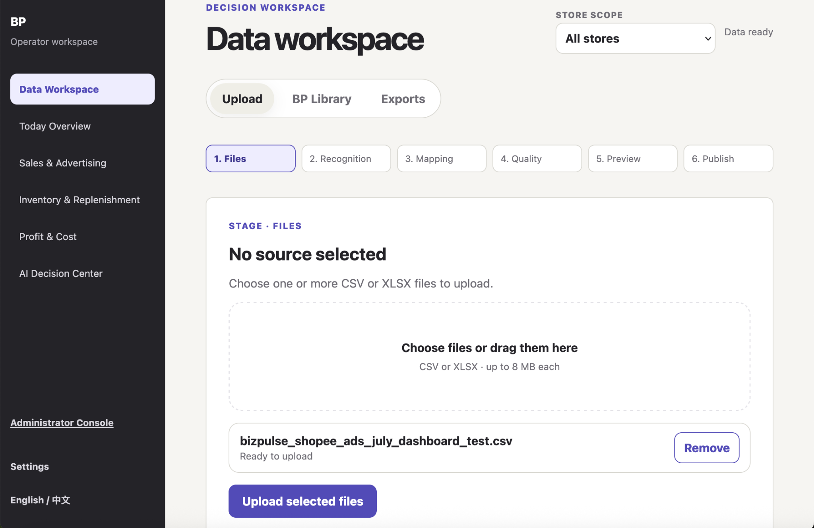

## 4.3 Recognize the Source

Go to **2. Recognition**.

Click **Recognize source**. BizPulse checks the file type, role, and fields.

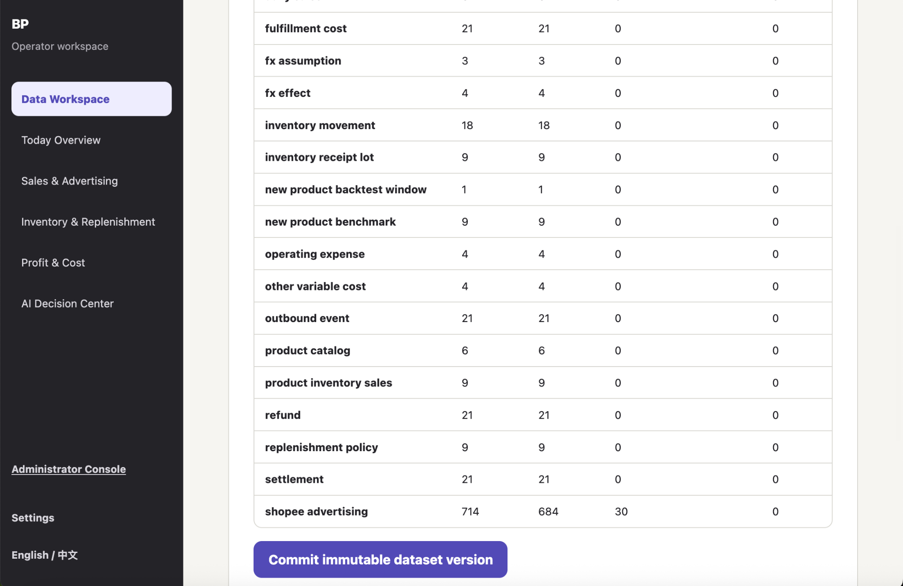

## 4.4 Confirm Mapping

Go to **3. Mapping**.

BizPulse proposes how source columns map to BizPulse fields. Review the mapping and click **Confirm suggested mapping**.

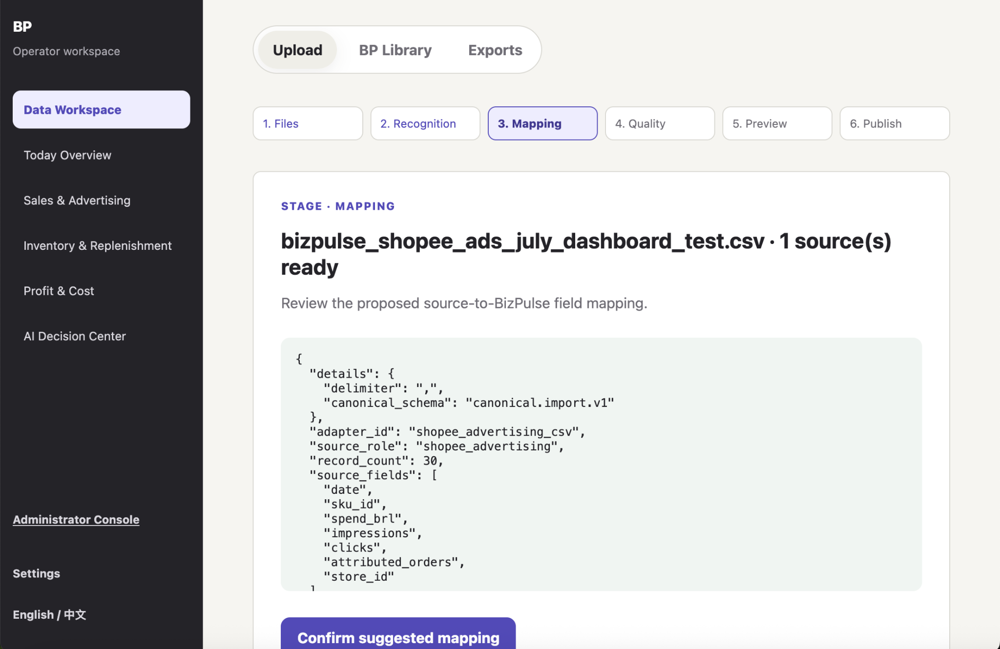

## 4.5 Review Quality

Go to **4. Quality**.

BizPulse checks the data quality. A successful file should show `status: passed` and no missing required fields.

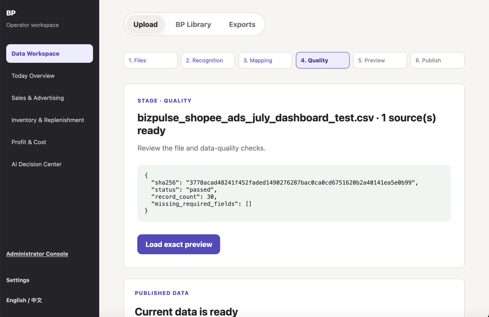

## 4.6 Preview the Data

Go to **5. Preview**.

Review the prepared standardized records. This lets the operator inspect the data before committing it.

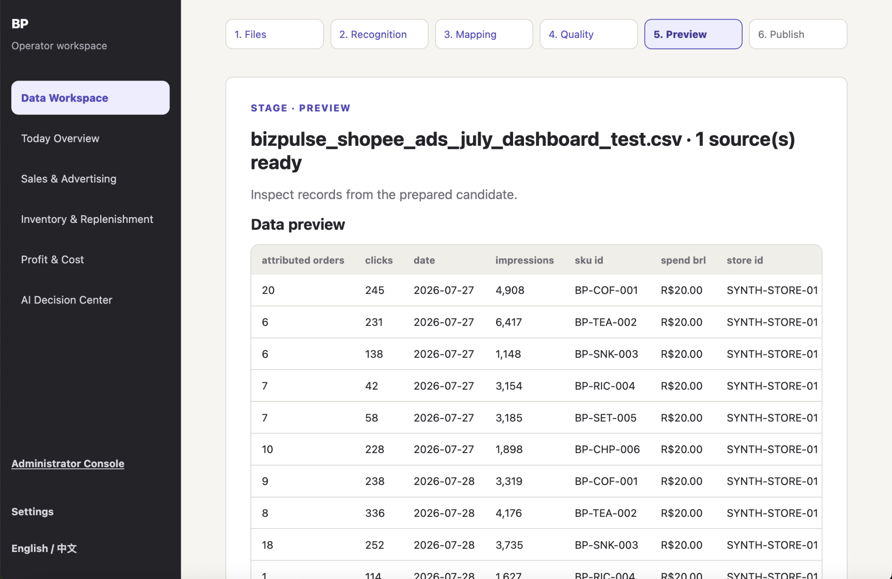

Click **Prepare commit plan** after reviewing the preview.

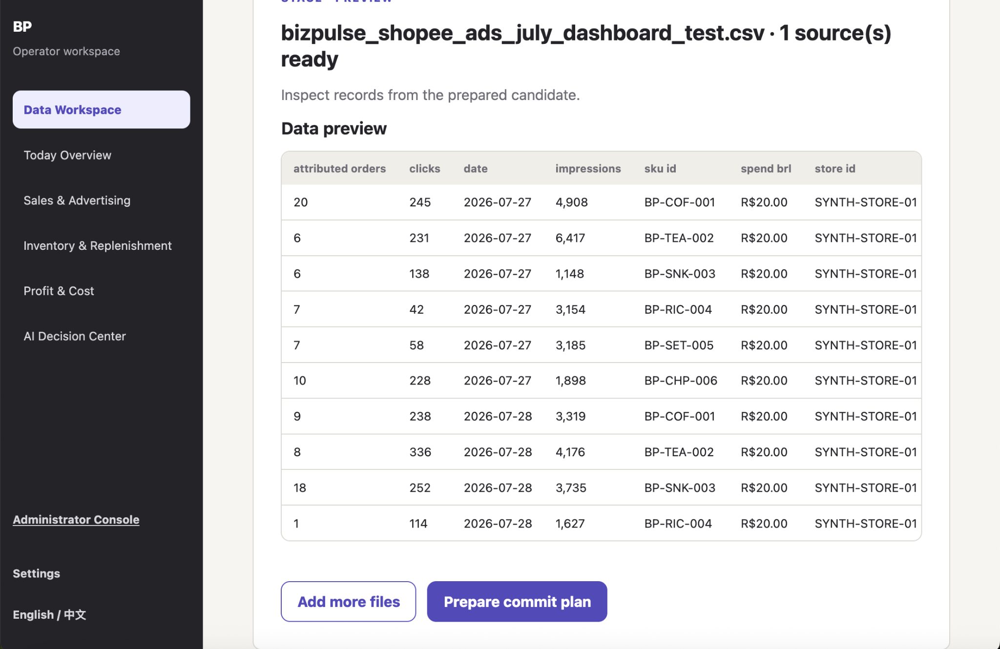

## 4.7 Commit the Dataset Version

BizPulse shows import quality, including rows read, rows kept, exact duplicates removed, and conflicts.

If the result is acceptable, click **Commit immutable dataset version**.

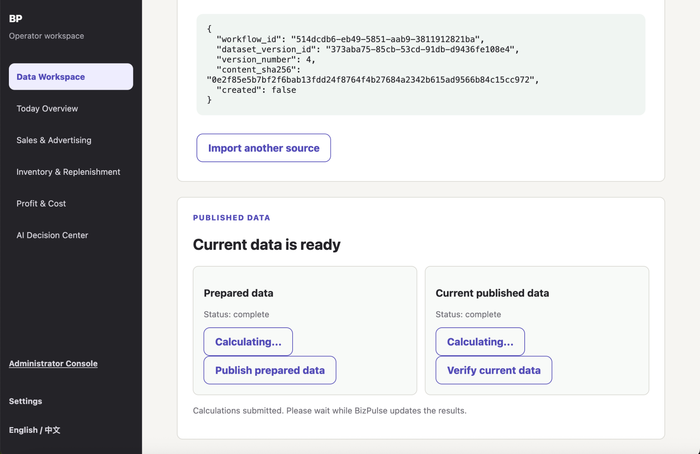

## 4.8 Calculate and Publish

After committing the dataset version, click **Calculate results**.

BizPulse calculates sales, inventory, profit, forecast availability, and action evidence.

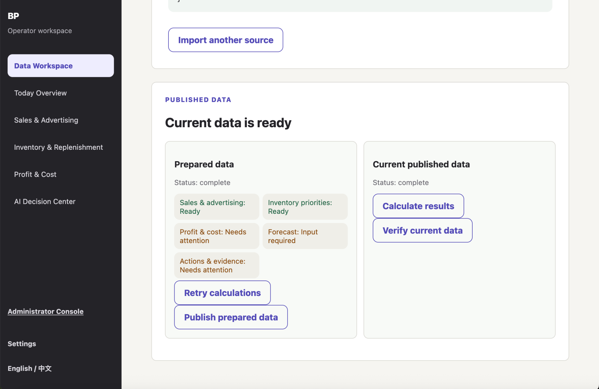

When prepared data is complete, click **Publish prepared data**. The published dataset becomes the current data used by dashboards.

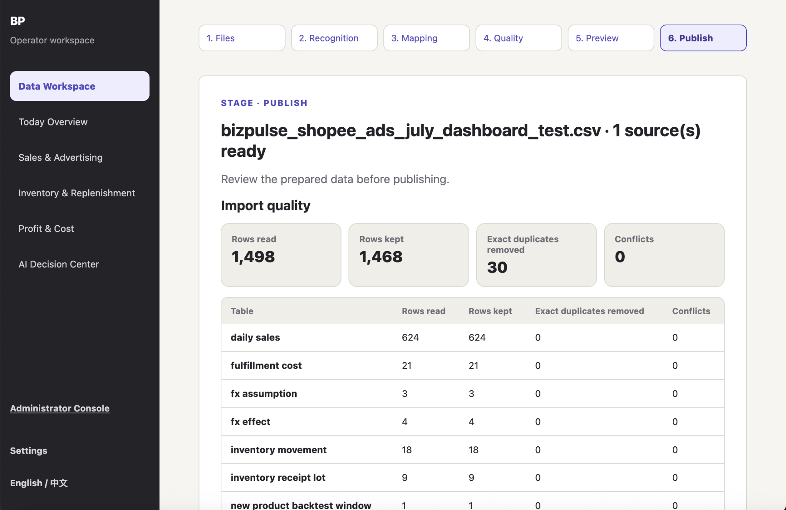

## 4.9 View Dashboard Results

### Today Overview

Use **Today Overview** to see business-level metrics such as net sales, orders, advertising spend, contribution profit, and stockout-risk SKUs.


### Sales & Advertising

Use **Sales & Advertising** to review gross sales, net sales, ad spend, and the daily sales trend.

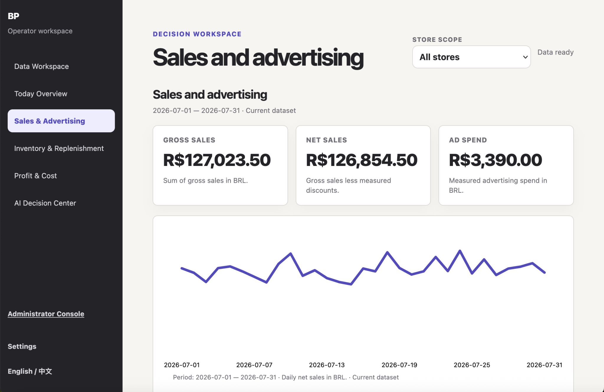

### Inventory & Replenishment

Use **Inventory & Replenishment** to review SKU coverage, immediate attention items, and replenishment priorities.

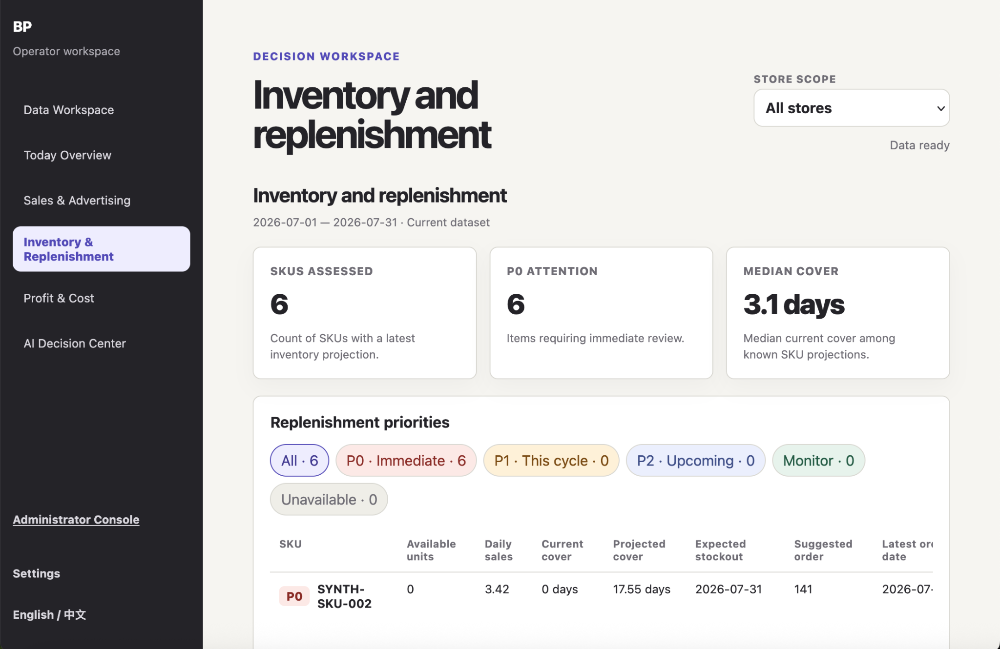

### Profit & Cost

Use **Profit & Cost** to review net revenue, contribution profit, operating profit, and cost breakdown.

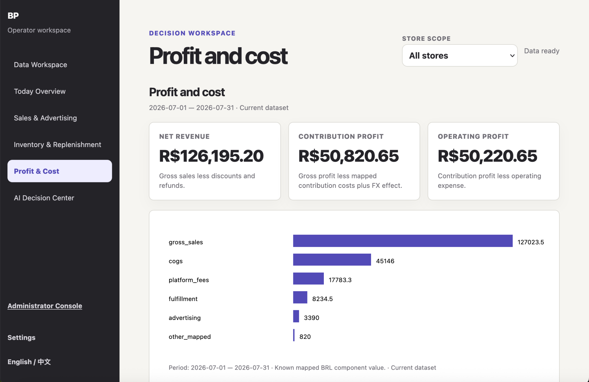

## 4.10 Use AI Decision Center

Use **AI Decision Center → Ask BizPulse** to ask evidence-based questions about the current published dataset.

Recommended demo question:

```text
Explain profit changes
```

The AI response explains published results and evidence. It does not create the underlying business calculations.

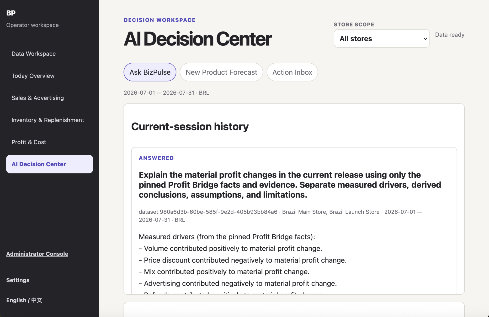

The page also shows authoritative facts and evidence cards.

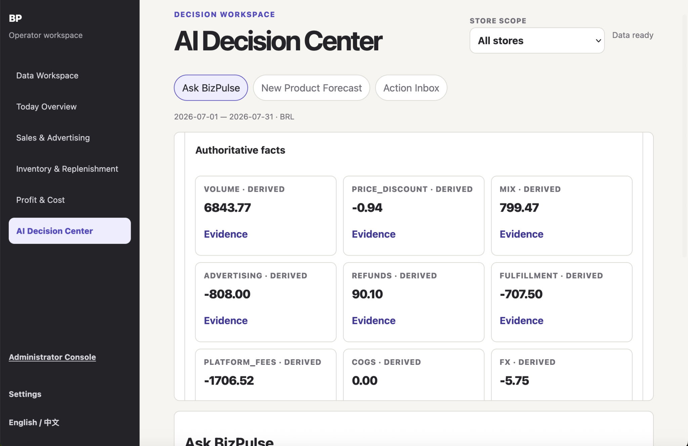

## 4.11 Important User Limitations

- Demo Viewer uploads are temporary and do not replace official dashboard data.
- Operator workflow is required to create, calculate, and publish official dataset versions.
- AI answers are limited to available published data and evidence.
- If evidence is insufficient, AI may reject or limit the answer instead of inventing a conclusion.
- Forecast may show unavailable/input required when forecast input data is missing.
- ROAS may show unavailable when the required attributed revenue or advertising evidence is missing.

## 4.12 Support Contact

For class demo support, contact the BizPulse project team/operator.

For production-style support, maintainers should review:

- Azure Container App logs
- `/health/ready` endpoint
- PostgreSQL connection health
- Blob storage configuration
- Admin AI Management channel/credential status
