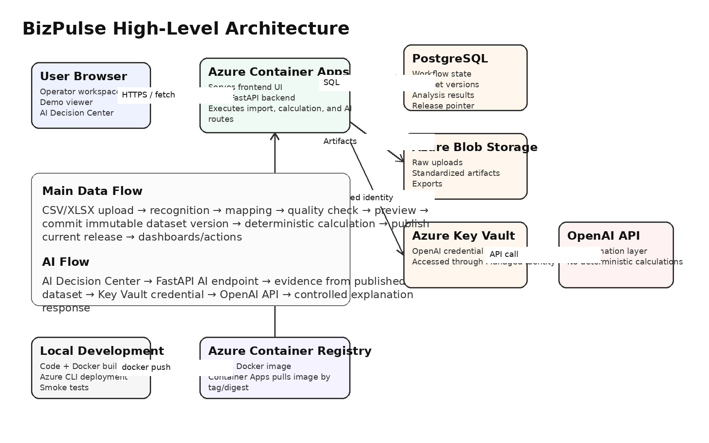

# 5. Architecture Diagram

## 5.1 High-Level Architecture



## 5.2 Component Roles

| Component | Role |
|---|---|
| User Browser | Runs the operator/demo UI and sends requests to backend APIs. |
| Frontend UI | Presents upload workflow, dashboards, Action Inbox, and AI Decision Center. |
| FastAPI Backend | Receives API requests and runs import, calculation, publish, dashboard, and AI services. |
| PostgreSQL | Stores workflow state, dataset versions, analysis outputs, release pointers, and audit data. |
| Azure Blob Storage | Stores raw uploads, standardized artifacts, and exports. |
| Azure Key Vault | Stores OpenAI API credential securely. |
| Managed Identity | Allows backend to read Key Vault secrets without exposing keys. |
| OpenAI API | Generates controlled explanations for published evidence. |
| Azure Container Registry | Stores Docker image. |
| Azure Container Apps | Runs the deployed container image. |

## 5.3 Data Processing Flow

```text
CSV/XLSX Upload
→ FastAPI import workflow
→ AdapterRegistry.inspect()
→ field mapping validation
→ AdapterRegistry.standardize()
→ quality preview
→ ImportService.commit()
→ immutable dataset version
→ DatasetPreparationService.prepare()
→ deterministic calculations
→ PublicReleaseService.publish()
→ dashboard and Action Inbox read current public release
```

## 5.4 AI Explanation Flow

```text
AI Decision Center
→ POST /api/v1/ai-chat/turns
→ FastAPI backend
→ AIChatService
→ current published dataset + evidence
→ OpenAI Gateway
→ OpenAI API
→ controlled explanation response
```

## 5.5 Security Boundary

- OpenAI key is not exposed to the browser.
- Key Vault stores the credential.
- Managed Identity is used for server-side access.
- Ordinary Login AI and Public Demo AI are controlled independently in Admin Console.
- AI responses are evidence-bound and may be rejected if they cannot be safely merged with authoritative facts.
